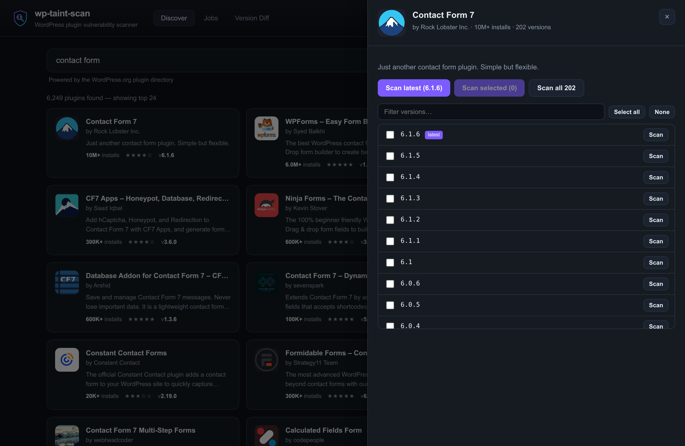
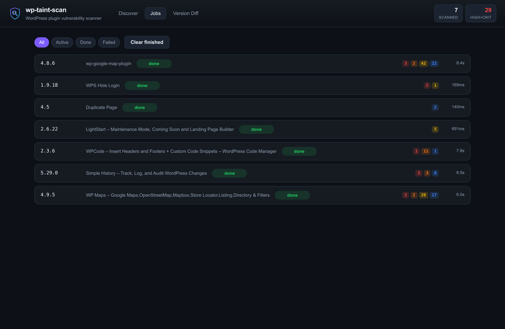
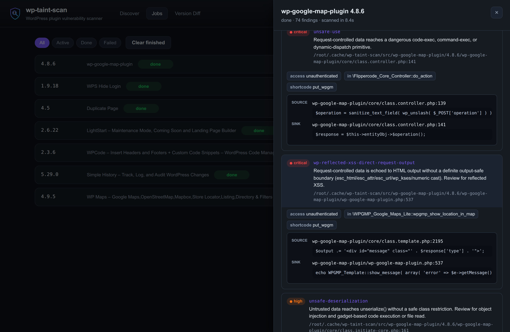
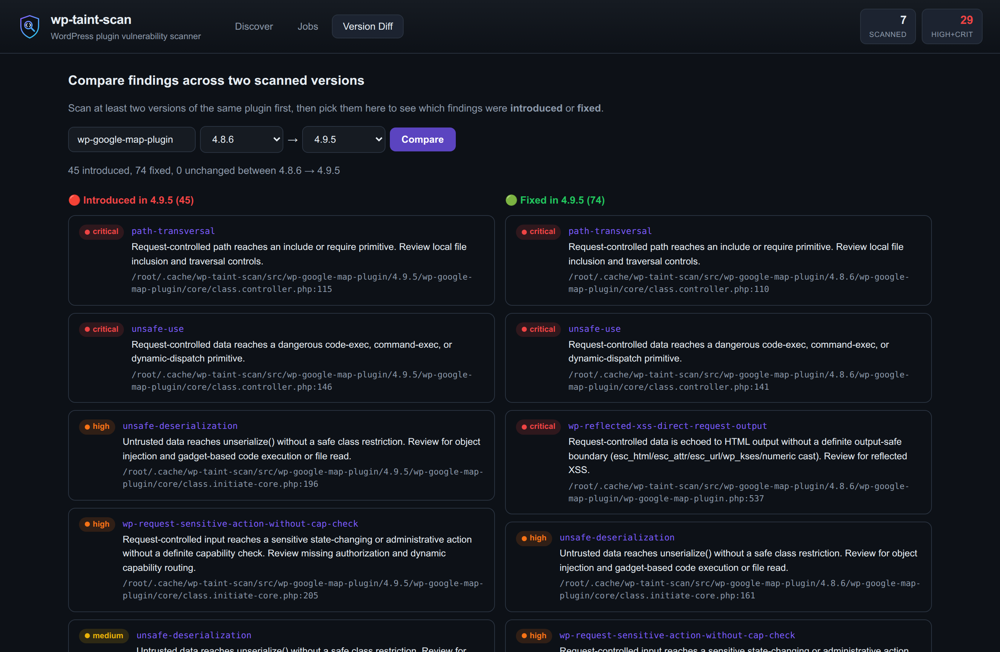

<div align="center">


<p><b>Find real vulnerabilities in WordPress plugins.</b> Search the plugin directory, scan any version — or every version — in parallel, and diff findings across releases. A native Go taint-analysis engine that understands the <i>WordPress security model</i>, not just generic source→sink flow.</p>

[](https://go.dev)
[](https://github.com/dimasma0305/wp-taint-scan/actions/workflows/ci.yml)
[](LICENSE)
[](https://github.com/dimasma0305/wp-taint-scan/pulls)


[Quick start](#install--build) · [Web UI](#web-ui) · [How it works](#why-its-different) · [HTTP API](#http-api)

<sub>⭐ If this is useful, a star helps others find it.</sub>

</div>

---

## Screenshots

|  |  |
|:--:|:--:|
| **Search the WordPress.org directory** | **Pick a version, or scan them all** |
| [](docs/screenshots/01-discover.png) | [](docs/screenshots/02-versions.png) |
| **Parallel scan dashboard (live)** | **Findings + source→sink dataflow trace** |
| [](docs/screenshots/03-jobs.png) | [](docs/screenshots/04-findings.png) |

**Version diff** — see exactly which findings were *introduced* or *fixed* between two releases:

[](docs/screenshots/05-diff.png)

```
plugin source ──▶ php-parser-go ──▶ call graph + taint propagation ──▶ findings
                                     (WordPress-aware authorization context)
```

> The analysis engine ships as a CLI (`taint-scan`, installed as `phparser`) and a web app (`taint-web`). No PHP runtime, no Semgrep, no external services — just Go.

## Why it's different

Generic taint scanners drown in false positives on WordPress code because they don't model how WordPress actually gates access. This engine encodes the real rules that decide whether a finding is exploitable:

- **A nonce is not authorization.** A valid nonce only proves the request came from the site's UI; it does not prove the user is allowed to perform the action. Nonce-without-capability is *the* dominant WordPress bounty pattern, and the engine treats it as such.
- **`is_admin()` is not an auth gate.** It checks whether the URL is under `/wp-admin/` — and `admin-ajax.php` always returns `true`. It is never treated as a capability check.
- **Capability tiers matter.** `current_user_can('read')` (subscriber/customer/student) is *authenticated*, not *privileged*. Missing-authorization bugs reachable by low-privilege users are surfaced and ranked above admin-only self-XSS.
- **Numeric sanitizers stop injection, not IDOR.** `intval()`/`absint()` make a value injection-safe but leave it attacker-controlled for resource selection (delete/action/disclosure) — so those flows stay tainted.

## Vulnerability classes detected

- **SQL injection** — `$wpdb` raw queries and non-`$wpdb` drivers (`mysqli_*`, PDO, `pg_query`, `sqlsrv_query`, `multi_query`), with `prepare()` parameterization and identifier-injection modeling.
- **Reflected & stored XSS** — unescaped request input reaching output, with a broad escaper/sanitizer model (`esc_html`/`esc_attr`/`esc_url`/`esc_js`, `json_encode`, attribute helpers, numeric casts) and format-aware `printf`/`vprintf`/`wp_die` sinks.
- **Path traversal / arbitrary file read, write, delete, include** — file-system sinks with path-safety modeling and zip-slip (`ZipArchive::extractTo`, `unzip_file`).
- **Missing-authorization / IDOR** — sensitive actions, file delete/upload, and record-read-to-output reachable without a capability check.
- **Privilege escalation** — tainted writes to `wp_capabilities`/user-meta, `grant_super_admin`, role/capability mutation.
- **Open redirect & header injection** — request-controlled redirect targets and response headers.
- **Dynamic-dispatch RCE** — request-controlled callable/method/class names (`$fn()`, `$o->$m()`, `Class::$m()`, `new $c()`).
- **REST/AJAX exposure surfaces** — endpoints with public or missing permission callbacks reaching sensitive sinks.

Analysis runs as independent **sink-op batches** (`delete`, `read`, `open`, `include`, `write`, `output`, `sql`, `action`, `call`) so each detector has its own relevance/scoring and one detector can't perturb another's results.

## Install & build

Requires **Go 1.25+**. The PHP parser ([`php-parser-go`](https://github.com/dimasma0305/php-parser-go)) is a normal module dependency — no extra checkout needed.

```bash
# install the web UI
go install github.com/dimasma0305/wp-taint-scan/cmd/taint-web@latest

# …or the CLI scanner
go install github.com/dimasma0305/wp-taint-scan/cmd/taint-scan@latest
```

Or from source:

```bash
git clone https://github.com/dimasma0305/wp-taint-scan
cd wp-taint-scan
go build -o bin/taint-web ./cmd/taint-web    # web UI
go build -o bin/phparser  ./cmd/taint-scan   # CLI scanner
```

Then launch the web UI and open <http://localhost:8080>:

```bash
./bin/taint-web
```

## Usage

```bash
# Scan a plugin directory
./bin/phparser -target /path/to/plugins/some-plugin -output-dir /tmp/scan

# Key flags
#   -target         plugin or source directory to scan
#   -output-dir     where to write results (defaults to a timestamped tmp dir)
#   -mem-limit-mb   soft heap ceiling (default 6144); aborts in-flight analysis under pressure
#   -phparser-workers / -max-passes   parallelism & fixpoint tuning
```

Each scan writes:

| File | Contents |
|---|---|
| `taint-results.json` | Machine-readable findings (rule id, message, source→sink trace, access tier). |
| `human-summary.md` | Findings ranked by exploitability (unauth/low-priv first). |
| `README.md` | Run metadata. |

## Web UI

`taint-web` is a self-contained web app for discovering and scanning plugins straight from the WordPress.org directory — search by name, browse every released version, and scan one version or a whole batch **in parallel**.

```bash
go build -o bin/taint-web ./cmd/taint-web
./bin/taint-web                 # http://localhost:8080
# flags: -addr -cache-dir -concurrency -mem-limit-mb -hard-cap-mb -timeout
```

What it gives you:

- **Search** the WordPress.org plugin directory by name (installs, rating, description).
- **Version picker** — every released version, newest-first; scan the latest, a multi-selected subset, or **all versions** as one batch.
- **Parallel scanning** — a bounded worker pool runs N versions at once; live progress via Server-Sent Events.
- **Findings viewer** — grouped by severity (derived from the WordPress access tier: `unauthenticated`→critical, low-priv→high, nonce-only→medium, capability-checked→low), each with the source→sink dataflow trace and code snippets. Filter by severity, export per scan as JSON or Markdown.
- **Version diff** — compare two scanned versions to see which findings were **introduced** or **fixed** (great for pinpointing the version that added or patched a bug).
- **Result + download caching** — re-scanning a version is instant; downloaded zips are reused.

### Isolation & safety

Every scan runs in a **separate child process** (`taint-web -scan-worker …`) — the same binary re-invokes itself — with a soft heap ceiling (`-mem-limit-mb`), a hard RSS watchdog (`-hard-cap-mb`, kills + marks the job *skipped*), and a wall-clock `-timeout`. A pathological mega-plugin therefore can never OOM or crash the server; only its own worker dies. Downloads are size-capped, zip extraction is **zip-slip-safe** with uncompressed-size/file-count limits, and all plugin/version inputs are strictly validated before they touch a URL or a filesystem path. The server only ever talks to the hardcoded `api.wordpress.org` / `downloads.wordpress.org` hosts (no SSRF), and the UI renders all untrusted plugin data as text (no HTML injection from malicious plugin code in snippets).

### HTTP API

| Endpoint | Purpose |
|---|---|
| `GET /api/search?q=` | search plugins by name |
| `GET /api/plugin?slug=` | plugin info + sorted versions + which are already scanned |
| `POST /api/scan` | `{slug, name, versions[], mode:"selected\|latest\|all", force}` → enqueue jobs |
| `GET /api/jobs[?batch=]` | list jobs (optionally one batch) |
| `GET /api/job?id=` | one job with findings |
| `GET /api/job/export?id=&format=json\|md` | download a report |
| `POST /api/cancel?id=` | cancel a queued/running job |
| `GET /api/diff?slug=&a=&b=` | finding delta between two scanned versions |
| `GET /api/stats` | aggregate counters |
| `GET /api/events` | Server-Sent Events stream of job updates |

## Mass-scanning safely (memory)

The engine's peak held memory is small (~0.2–0.7 GB on normal plugins), but a handful of
mega-plugins (WooCommerce/Elementor-scale) can trigger a transient interprocedural-instantiation
allocation burst that outpaces the garbage collector. **Go cannot abort an allocation
mid-flight**, so `-mem-limit-mb` reduces — but cannot *guarantee* — no OOM.

For scanning a whole plugin tree, use the watchdog as the outer loop:

```bash
./scan-capped.sh /path/to/plugin /tmp/out 10   # hard 10 GB RSS cap
# exit 0 = scanned, 75 = skipped (exceeded cap, host protected), other = phparser's exit
```

`scan-capped.sh` runs the scan under a hard RSS ceiling and kills + skips a pathological
plugin instead of crashing the host. See [`docs/EFFECTIVENESS_AUDIT_2026-06.md`](docs/EFFECTIVENESS_AUDIT_2026-06.md)
and [`docs/OPTIMIZATION_PLAN.md`](docs/OPTIMIZATION_PLAN.md) for the full memory analysis.

## Validation

The engine is validated against a **72-case real-CVE corpus** (57 with locally reproduced
plugin fixtures). The comparison harness lives in `test/semgrep_bundle_corpus/`:

```bash
# Fetch the vulnerable-plugin fixtures (large; not committed)
python3 test/semgrep_bundle_corpus/download_corpus_plugins.py

# Run the engine against the corpus and diff expected vs. found
go run ./cmd/corpus-compare
```

The committed `corpus.json` is the manifest of CVEs and expected findings; the plugin
fixtures (~685 MB) are fetched on demand. Unit/regression tests:

```bash
go test ./...
```

## Repository layout

```
cmd/
  taint-scan/       main vulnerability scanner CLI  (binary: phparser)
  corpus-compare/   corpus validation harness
  lower-bundle/     PHP bundle lowering (legacy Semgrep migration path)
  semgrep-target/   native Semgrep target/orchestration wrapper
  semgrep-bundle/
internal/
  taintscan/        the taint-analysis engine (sources, sinks, sanitizers,
                    WordPress context, call graph, propagation)  — ~70k LOC
  corpuscompare/    corpus diff logic
  lowerbundle/      bundle lowering
scan-capped.sh      RSS watchdog for safe mass-scanning
test/               CVE corpus manifest + fetch/report scripts
docs/               effectiveness audits, optimization plans, roadmap
```

## Dependency

Built on **[`php-parser-go`](https://github.com/dimasma0305/php-parser-go)** (a native Go port of nikic/PHP-Parser) for PHP parsing/AST — pulled in as a versioned module, no other third-party dependencies. To hack on both repos at once, side-by-side:

```bash
git clone https://github.com/dimasma0305/php-parser-go
git clone https://github.com/dimasma0305/wp-taint-scan
cd wp-taint-scan && go work init . ../php-parser-go
```

## Contributing

Issues and PRs welcome. `go build ./...`, `go test ./...`, and `go vet` should pass; CI runs build + vet + race tests on every PR. No plugin-specific or CVE-specific logic in the engine — detectors must be generic.

## License

[MIT](LICENSE) © Dimas Maulana ([dimasma0305](https://github.com/dimasma0305)). The bundled `php-parser-go` derives from [nikic/PHP-Parser](https://github.com/nikic/PHP-Parser) (BSD-3-Clause).

> Intended for **authorized** security testing, CTF, and defensive research — scan plugins you own or are permitted to test.
